# Challenge Experience

[[中文]](https://github.com/ryanxingql/winner-ntire22-vqe/blob/main/blog_zh.md) [[Project page]](https://github.com/ryanxingql/winner-ntire22-vqe)

Author: [Qunliang Xing](https://ryanxingql.github.io/)

Collaborators: Meisong Zheng, [Minglang Qiao](https://github.com/MinglangQiao), [Lai Jiang](https://github.com/remega), [Mai Xu](https://scholar.google.com/citations?user=JdhDuXAAAAAJ), Huaida Liu and [Ying Chen](https://scholar.google.com/citations?user=NpTmcKEAAAAJ).

- [Challenge Experience](#challenge-experience)
  - [0. Challenge Background](#0-challenge-background)
  - [1. Final Solution](#1-final-solution)
  - [2. Prepare the Training Data](#2-prepare-the-training-data)
    - [2.1. Offline Validation Set](#21-offline-validation-set)
    - [2.2. Category Balance](#22-category-balance)
  - [3. Select the Baseline Model](#3-select-the-baseline-model)
  - [4. Improve the Baseline Model](#4-improve-the-baseline-model)
    - [4.1. Failed Attempts](#41-failed-attempts)
      - [4.1.1. Introduction of Transformer](#411-introduction-of-transformer)
  - [5. Optimize the Training Method](#5-optimize-the-training-method)
    - [5.1. Progressive Training](#51-progressive-training)
    - [5.2. Three-step Convergence](#52-three-step-convergence)
    - [5.3. Remove Duplicated Frames](#53-remove-duplicated-frames)
    - [5.4. General Tricks](#54-general-tricks)
  - [6. Optimize the Test Method](#6-optimize-the-test-method)
    - [6.1. Remove Duplicate Frames](#61-remove-duplicate-frames)
    - [6.2. General Tricks](#62-general-tricks)
  - [7. Model Cascading](#7-model-cascading)
  - [8. Postscript](#8-postscript)

## 0. Challenge Background

The full name of the NTIRE Challenge is "New Trends in Image Restoration and Enhancement workshop and challenges on image and video processing". The NTIRE challenge is one of the most famous CVPR workshops (A total of about 71 workshops are included in [CVPRW 2022](https://cvpr2022.thecvf.com/workshop-schedule)). NTIRE is a workshop hosted by [Radu Timofte](https://scholar.google.ch/citations?user=u3MwH5kAAAAJ&hl=en), which is first held at [ACCV 2016](https://data.vision.ee.ethz.ch/cvl/ntire/) and has since become a regular at CVPRW.

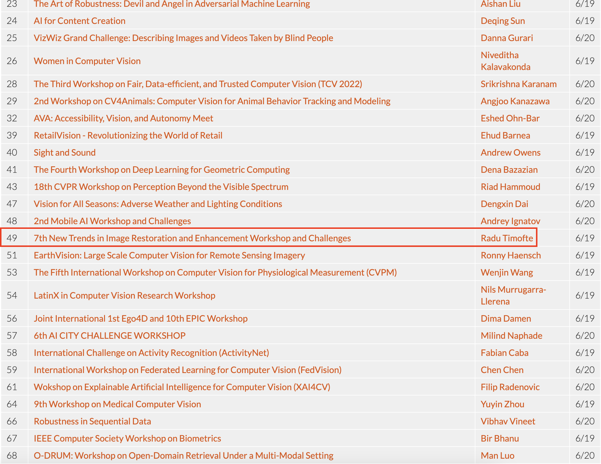

Figure: CVPRW22.

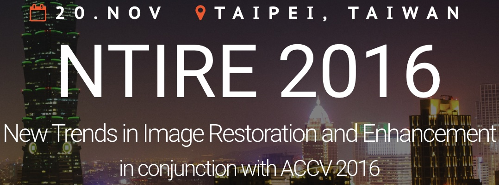

Figure: NTIRE16.

The NTIRE challenge is broken down into multiple challenges. The multi-frame quality enhancement challenge is organized by [Yang](https://scholar.google.ch/citations?user=3NgkOp0AAAAJ&hl=en) and Radu starting in 2021, which [initially](https://data.vision.ee.ethz.ch/cvl/ntire21/) contains two main tracks: fidelity (PSNR) optimization and perceptual quality (MOS) optimization. The organizers delete the perceptual track [this year](https://data.vision.ee.ethz.ch/cvl/ntire22/) and introduce the super-resolution and enhancement tracks.

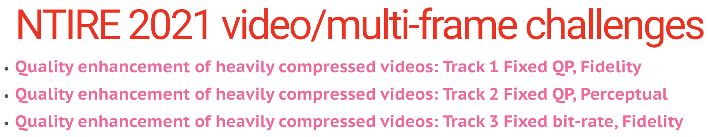

Figure: NTIRE21 multi-frame quality enhancement challenges.

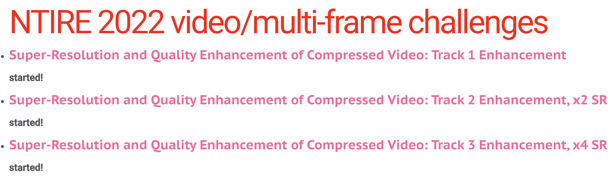

Figure: NTIRE22 multi-frame quality enhancement challenges.

In recent years, more and more teams have been pouring into these challenges and publicizing their titles. It has become more and more difficult to win the championship.

The participating teams in NTIRE21 include Peking University, Tsinghua University, Fudan University, Nanjing University, NTU S-Lab, Tencent, Bilibili, ByteDance, DJI, Huawei Noah, BOE, etc.

This year, more teams from Alibaba, ZTE, Xiaomi, XPixel, Tencent GY-Lab, the Institute of Automation of the Chinese Academy of Sciences, Beihang University, Harbin Institute of Technology, University of Electronic Science and Technology, Nanjing University of Science and Technology and SIAT have also participated.

Figure: NTIRE21 teams.

[Beihang MC2 Lab](http://www.buaamc2.net/) has been focusing on video quality enhancement methods for many years. This time, we cooperate with the [Tao Tech department](https://tech.taobao.org/) of Alibaba, which supports Taobao video business. We join forces to participate in the competition.

## 1. Final Solution

- Data
  - Official data-set (LDV data-set), containing 240 qHD videos down-sampled from 4K resolution.
  - 870 4K high-quality videos collected from YouTube.

- Framework: Two cascading models (as two stages)

- Baseline models
  - Stage I: BasicVSR++
  - Stage II: SwinIR

- Model enhancement
  - The second-order propagation in BasicVSR++ is changed to PQF propagation.
  - The five residual blocks for reconstruction in BasicVSR++ are increased to 55 blocks.

- Training methods
  - Progressive training: 10 residual blocks for reconstruction are added each training time, and thus we train the stage I model for six times.
  - Three-step training: (1) Charbonnier loss and full data-set, (2) MSE loss and full data-set, and (3) MSE loss and official data-set.
  - Remove duplicated frames in LQ.

- Test methods
  - x8TTA
  - Model ensemble for track 3
  - Remove duplicated frames in LQ.

## 2. Prepare the Training Data

The challenge does not constrain the training set of participants. In NTIRE21, basically, all teams collected additional data for training.

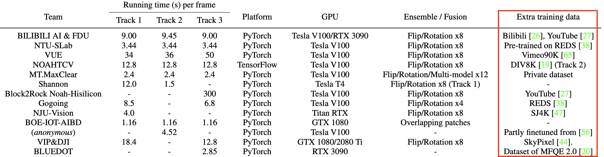

Figure: Most teams in NTIRE21 used additional data.

We took a hard look at NTIRE21 data report. Following this report, we collected 1,000 videos from YouTube in addition to the official data-set. Key points:

- Video categories: We collected 100 4-30s videos each for ten categories of videos. These categories are set by NTIRE21, including animal, city, closeup, fashion, human, indoor, park, scenery, sports, and vehicle.
- Shooting quality: We found that the organizers prefer PGC (Professionally Generated Content), such as documentaries, LCD demos, etc. We require PGC to account for about 80% of videos.
- Shooting conditions: We collected 30% normal, 20% low light, 20% fast-moving and 30% handheld videos.
- Shooting angle of view: We collected 40% head-up, 20% FOV (field of view, such as fisheye, large aperture), 20% aerial, and 20% up-view videos.
- Frame rate: low frame rate and high frame rate videos each account for a certain proportion.
- Image quality: high bit rate was required, as it is always related to slight noise and compression; bright scene and clear texture patterns were also required.
- Content redundancy: Up to 4 videos (or precisely "clips"/"sequences") can be cut from a single complete video.
- No scene switches.

We finally collected 1,600 videos (including 600 unqualified videos) in total.

The gain for the extra data is 0.1-0.2 dB.

### 2.1. Offline Validation Set

The official online validation set does not provide ground truth videos; we need to submit our enhanced videos on the website and then check the average score of PSNR. There are two problems with this:

1. We cannot submit frequently due to the great time cost and the limited number of submissions.
2. We cannot know the result of each video and each frame.

Therefore, we select one video each for 10 categories as our offline validation set. Most of them are selected from the last year's test set.

Figure: We test on our offline validation set.

Our offline validation set is very useful during the competition:

1. Convenient and fast: There are 15 videos in the official online set, while our offline set has only 10 videos to test. Besides, we do not need to submit our results; we can calculate the PSNR by ourselves.
2. Accurate: Our offline results and the online results are in exactly the same trend.
3. Detailed: We can know the detailed results on different videos, frames, and categories.

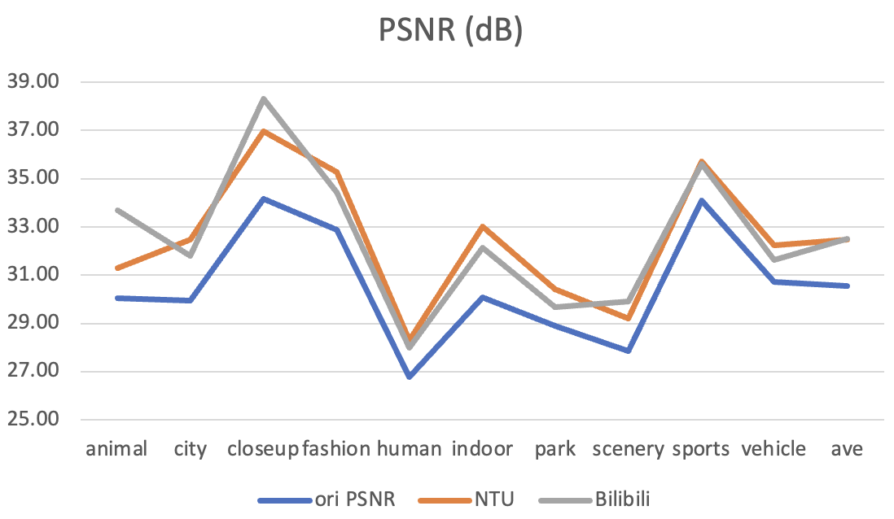

Figure: We can observe that the original and enhanced PSNR scores are different between different categories of videos.

### 2.2. Category Balance

As mentioned above, we collected 1,600 videos for training, among which 600 videos are unqualified (noisy, with high similarity, etc.).

In the beginning, we put all 1,600 videos into our training set. Late in the competition, I found that the number of videos in each category was very uneven: for example, the city category had only 87 videos, while the fashion category had 200+ videos. Most of the fashion videos are with black backgrounds and in poor quality. Therefore, we randomly select 87 videos for each category, and a total of 870 videos are selected for training. After this, the model performance was improved by 0.02 dB.

Btw, don't underestimate 0.02 dB. On the final test set of the three tracks, we are 0.009 dB higher, 0.101 dB higher, and 0.012 dB lower than the Tencent GY-Lab.

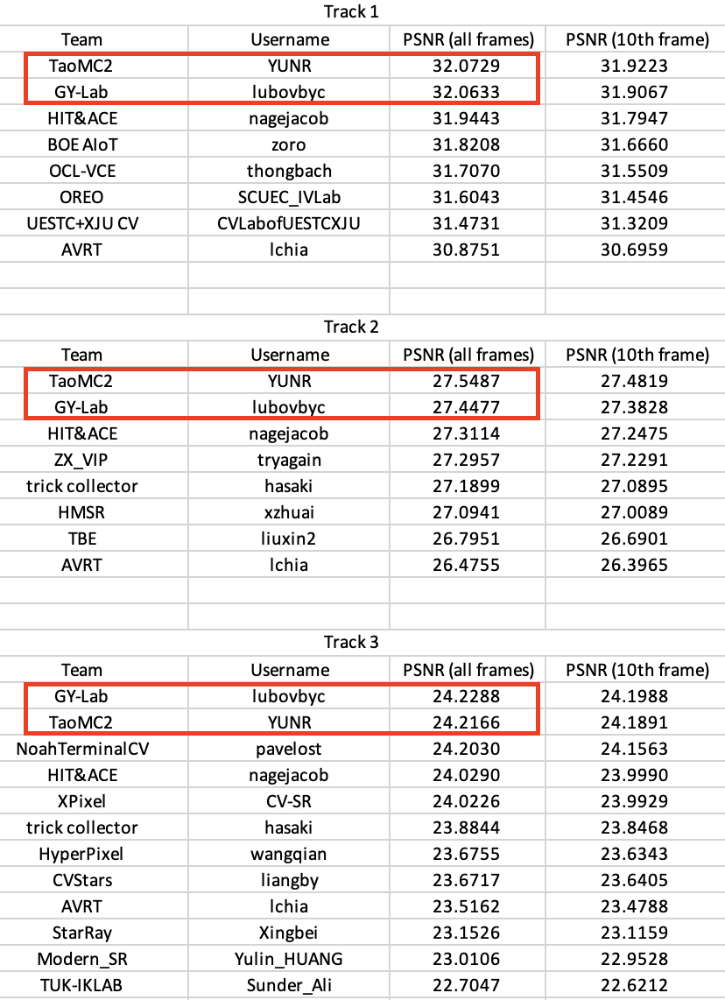

Figure: Final result.

## 3. Select the Baseline Model

There are two ways to win the competition:

1. Proposing disruptive network structures, such as ResNet, MPRNet, EDVR, and BasicVSR.
2. Improving the baseline model.

A good network structure can always serve as the baseline model of competition for several years. We chose the second option.

When choosing the baseline model, we thought about whether to choose a transformer-based network structure. We analyzed the feasibility and reliability of the transformer, especially the representative VRT method, and found three main issues:

- We have insufficient GPU memory: VRT uses 8 A100 GPUs with 80 GB memory each. Instead, we have only one machine with 8 V100 GPUs of 32 GB memory and several machines with 4 V100 GPUs.
- Training transformers is time-consuming: VRT takes about 5-7 days to train a model, and the speed of A100 is 3 times that of V100, so it takes at least half a month for us to train the same model.
- The performance of the video transformer is limited: According to VRT's report, on 7-frame short videos (such as Vimeo data-set), VRT's performance exceeds that of BasicVSR++; but for long videos (such as REDS with 100 frames per video), VRT cannot input more than 16 frames at one time due to the limited video memory, while BasicVSR++ can input more than 30 frames; as a result, the performance of VRT is lower than that of BasicVSR++.

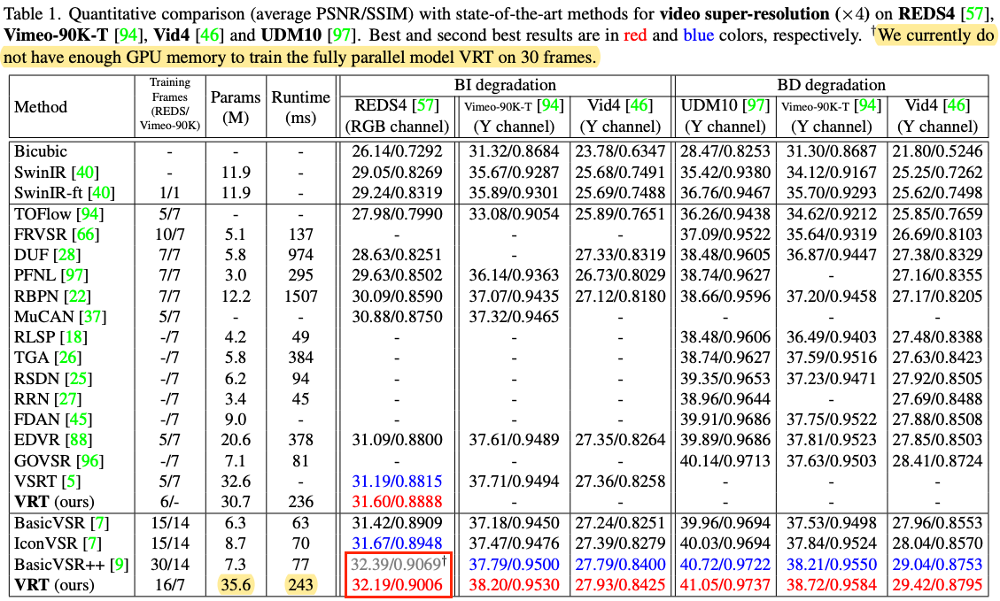

Figure: VRT experiment report.

Therefore, we decided to use BasicVSR++ based on RNN (actually CNN) as the baseline model. Of course, there are still other reasons for choosing BasicVSR++:

- Excellent performance (achieved 2nd place only with REDS in NTIRE21).
- High complexity (it consumes up to 22 GB memory per GPU with an input of 256x256 patch); instead, other small models have not been verified by competitions, and we dare not adopt them.
- The quality of open-sourced codes is good (the training code is not open-sourced, but its test code is merged into mmediting).
- The open-sourced pre-trained model can be directly used for our fine-tuning, which is very time-saving. Note that it will take a week to train a BasicVSR++ model from scratch.

Nevertheless, we decided to try the transformer in modules. See Section 4.1.1.

See Section 7 for the baseline model of stage II.

## 4. Improve the Baseline Model

To improve the baseline model, we conducted in-depth research on the proposers of the baseline model. Because in their years of research, there must be experiences and key findings in their papers.

Let's take Kelvin, the author of BasicVSR(++), as an example.

- Kelvin investigates the bottleneck of the EDVR model in his 2021 AAAI [article](https://arxiv.org/abs/2009.07265). In this article, Kelvin shows us that although DCNs with temporal alignment in the feature domain are more powerful than the traditional optical flow methods in the pixel domain, the learned flows and DCN offset are almost the same. Then, since the DCN offset is so unstable and difficult to learn during end-to-end learning, we can add a loss function to the DCN offset, requiring it to be consistent with the optical flow. With additional supervision, the learning of the DCN offset is stabilized.

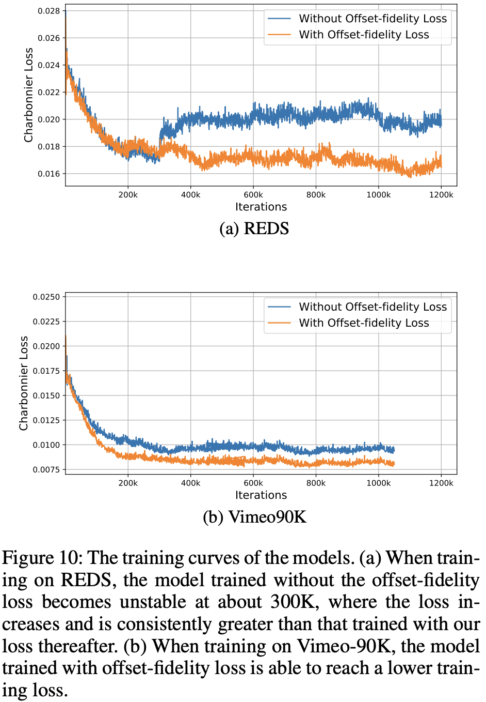

Figure: The overflow of DCN in EDVR usually occurs at 300K iterations, at which time the model loss rises.

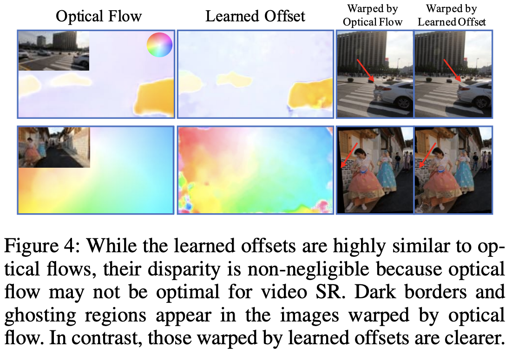

Figure: The learned flow and DCN offset are almost the same, which lays the groundwork for the stability improvement of DCN offset in BasicVSR++.

- Kelvin further improved this strategy in BasicVSR++, that is, the optical flow is used as the base, an additional residual is learned, and then the base and the residual are added to become the offset of the DCN.

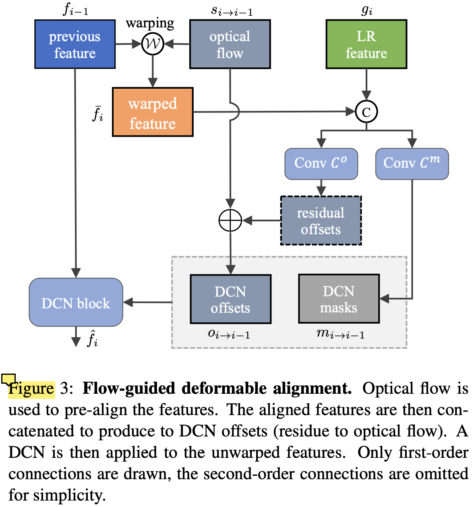

Figure: flow-based DCN offset in BasicVSR++.

From the above, we have two key points:

- Alignment plays a very important role in video enhancement tasks.
- We should not use DCNv1/v2 in EDVR and STDF, but use a more advanced DCN such as the flow-based DCN in BasicVSR++.

Next, take our lab works as examples.

- In Yang's [article](https://arxiv.org/abs/1903.04596), Yang studied the contributions of different frames in LSTM and showed that PQF did play a very important role in video enhancement.

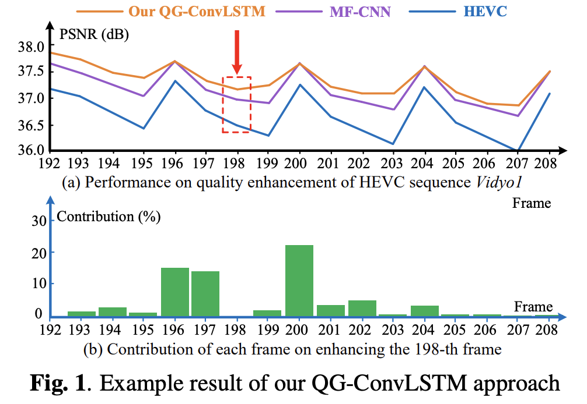

Figure: PQF plays a very important role in the LSTM-based quality enhancement.

- In my [MFQEv2](https://arxiv.org/abs/1902.09707) ablation, I tried feeding adjacent frames into a sliding window network, and the result dramatically dropped, far worse than feeding PQFs.

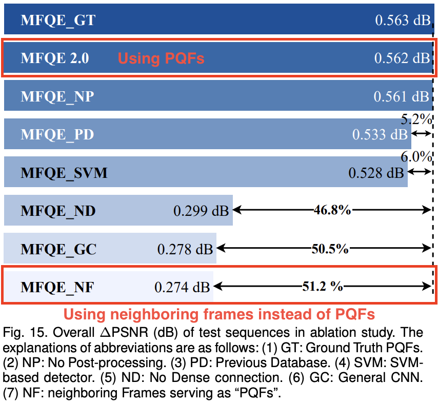

Figure: PQF is also very important for sliding window networks.

Therefore, PQF will play a key role in the task of compressed video quality enhancement.

Back to our baseline model. For some non-PQFs, the features from neighboring PQFs cannot be directly propagated either by forward or backward propagations. Therefore, I propose to replace the second-order propagations in BasicVSR++ with PQF propagations. Model performance improved by 0.05 dB.

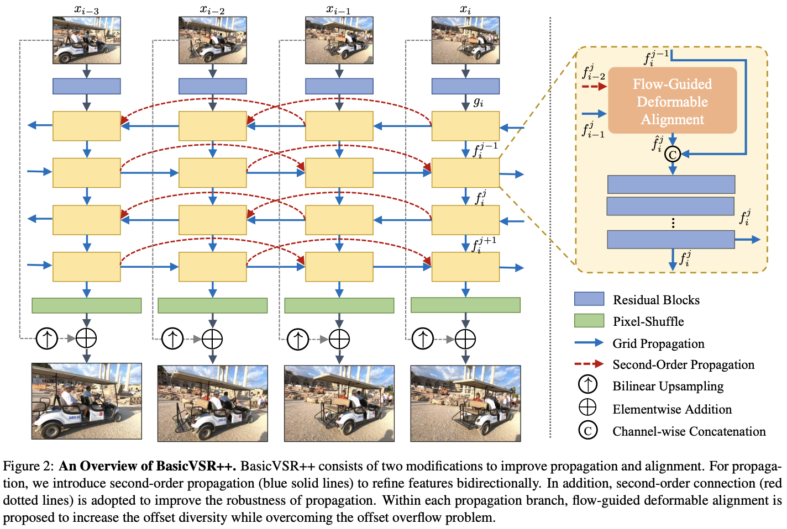

Figure: Propagation of BasicVSR++.

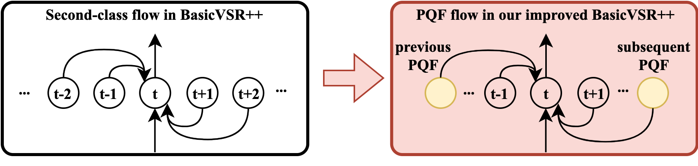

Figure: PQF propagation.

In addition, we increased the original 5 residual blocks in the reconstruction module to 55 blocks. For our training methods, see Section 5.1.

### 4.1. Failed Attempts

We have also tried other improvements, but most of them have failed. For example, we follow [IconVSR](https://arxiv.org/abs/2012.02181) to build an additional refill branch on PQF; we follow [RealBasicVSR](https://arxiv.org/abs/2111.12704) to pre-clean the input image. These methods were applied to our large model and had no effect.

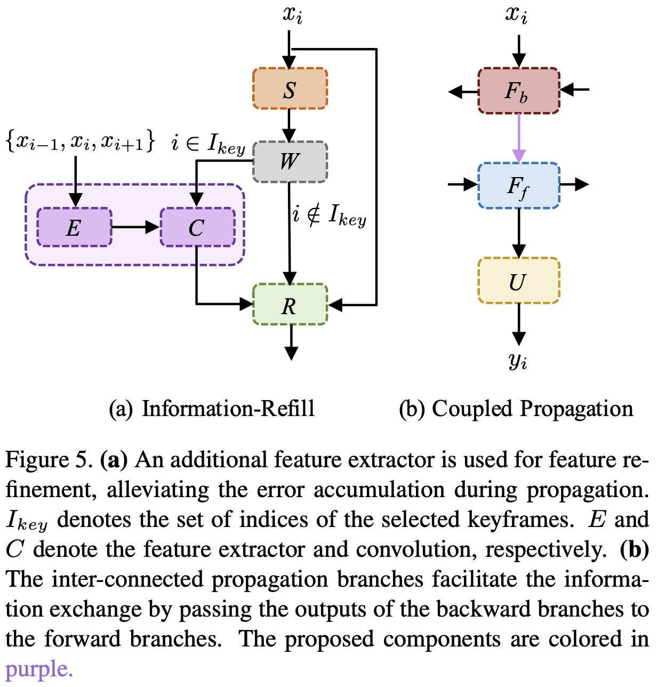

Figure: Refill key frames.

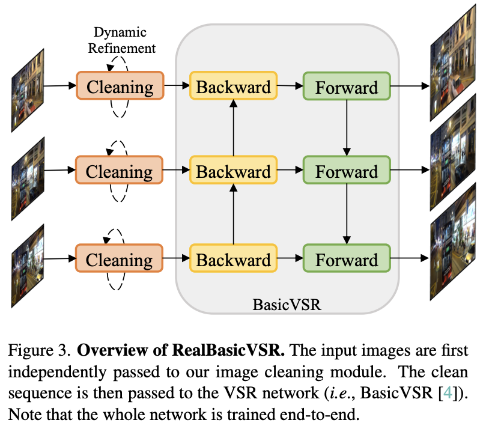

Figure: Pre-clean the input image.

In my view, some methods are effective in paper mainly due to the increment of complexity. When we practice these methods on a complex big model, the magic of these methods disappears. That is why I emphasized that we should choose a baseline network that is complex enough and is proven to be effective in competitions.

In addition, we noticed that the BasicVSR++ network has a pear-shaped structure: 5 blocks at both ends and 25 blocks in the middle. We have tried reducing the number of blocks in the middle and increasing the number of blocks in the two ends, especially the reconstruction part, but the performance became worse.

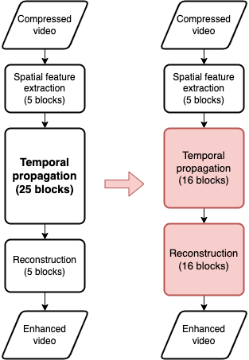

Figure: Pear-shaped structure and modified version.

This experiment was not done in vain, at least there are two inspirations for us:

1. Feature extraction cannot be too complicated, otherwise, the features are too clean and the details are lost. This is consistent with the finding of [RealBasicVSR](https://arxiv.org/abs/2111.12704).
2. Propagation is very important since fewer blocks can result in performance loss.

In addition, we also tried new network structures such as ConvNeXt, which is highly recognized in the high-level vision. But it did not work well in the low-level vision. Furthermore, we found that complex structures such as RDNs tend to be less effective than residual blocks. Therefore we still use the residual blocks.

Figure: ConvNeXt surpasses Swin transformer and ResNet on the high-level vision.

#### 4.1.1. Introduction of Transformer

Following SwinIR, I replaced a few residual blocks with Swin blocks. I have tried various replacing methods but get no gain. On the contrary, we consumed more GPU memory, and the inference time was longer due to the self-attention calculation.

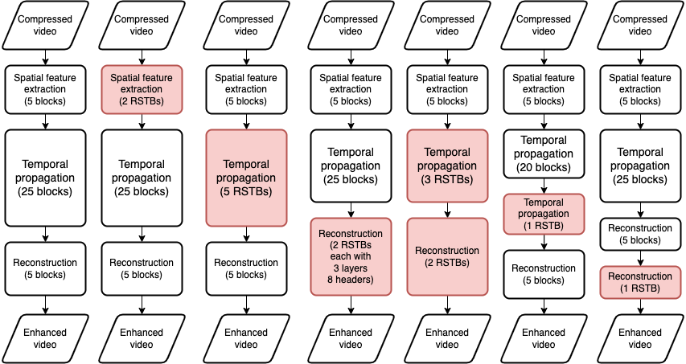

Figure: Various replacing methods tried.

Among these methods, replacing front-end modules with Swin blocks did the worst, and replacing back-end modules worked best. We suspect that replacing front-end modules results in large error propagation in the early stages of training; conversely, replacing back-end modules has less impact.

We also believe that to use the transformers well, the transformers must be pre-trained on a large data-set. It is difficult to achieve the effect of CNNs by directly copying a Swin block and training them from scratch.

During the experiment, I tried to ensemble the two best models. One model is the best model with Swin blocks named swinv2p4-5k, and the other is with no Swin blocks named v4p6-35k. I took the average of their outputs. The PSNR result is higher than those of these two models.

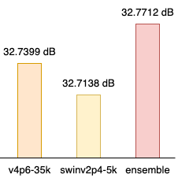

Figure: Ensemble of two models produces a best result.

## 5. Optimize the Training Method

### 5.1. Progressive Training

It is very difficult to directly train a large model. Our final model has up to 70 million parameters. Each module in the network relies on the previous module. If the front-end module does not converge in the early stage of training, then the input of the back-end module is problematic. Therefore, direct end-to-end training is hard to obtain a good model. Therefore, we need to progressively train and converge each module of our large model.

We added 10 residual blocks for reconstruction each training time, i.e., from 5 to 55 blocks (until the 32GB V100 memory is filled up). Therefore, we took a total of 6 times of training. In this way, the training cost is very high, but the gain is also obvious. Compared with the direct end-to-end training of our large model, the improvement is about 0.1 dB.

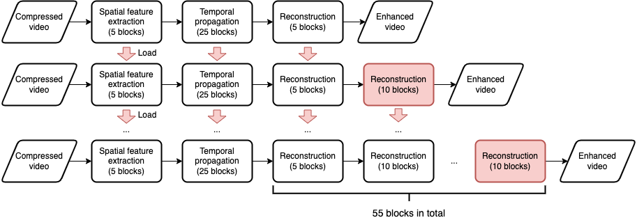

Figure: 10 residual blocks are added to the reconstruction module each time, and the parameters are not fixed; the previously trained parameters should be loaded.

### 5.2. Three-step Convergence

We all know that optimizing MSE is equivalent to optimizing PSNR. But strangely, nearly half of the teams in NTIRE21 use the Charbonnier loss function.

We first did experiments and found that the model with Charbonnier loss converged much faster than the model with MSE loss. Moreover, the PSNR can be higher for the model with Charbonnier loss. A large number of articles corroborate this finding, like [this](https://www.mdpi.com/2079-9292/10/11/1234/pdf):

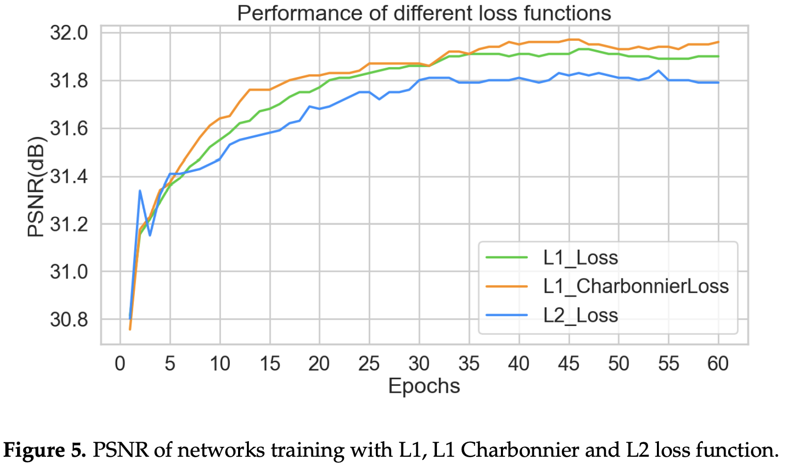

Figure: PSNR performance with Charbonnier loss on SISR task is better than that with L2 loss.

We used Charbonnier loss first and then switched to L2 loss after the model converged. The model performance was further improved by 0.02 dB.

Finally, we used the L2 loss and trained our model on the official LDV data-set. This step further improved the performance of our model by 0.02 dB. We guess that the official data-set can better reflect the organizers' preference for data; besides, our data generation process may have a certain deviation from the official one.

### 5.3. Remove Duplicated Frames

We discovered by accident that about 30% of the videos had duplicated frames, both the official data-set and our data-set.

There are no duplicate frames in the ground truth videos, but because the adjacent two frames are so similar (50-70 dB), they become identical after compression.

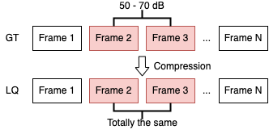

Figure: Duplicated frames.

Earlier we mentioned that temporal information and alignment play a key role in quality enhancement. BasicVSR shows that as the number of input frames decreases, the performance also decreases; and a very important reason why VRT does not exceed BasicVSR++ is that it can only handle 16 frames of video, while BasicVSR++ can handle 30 frames.

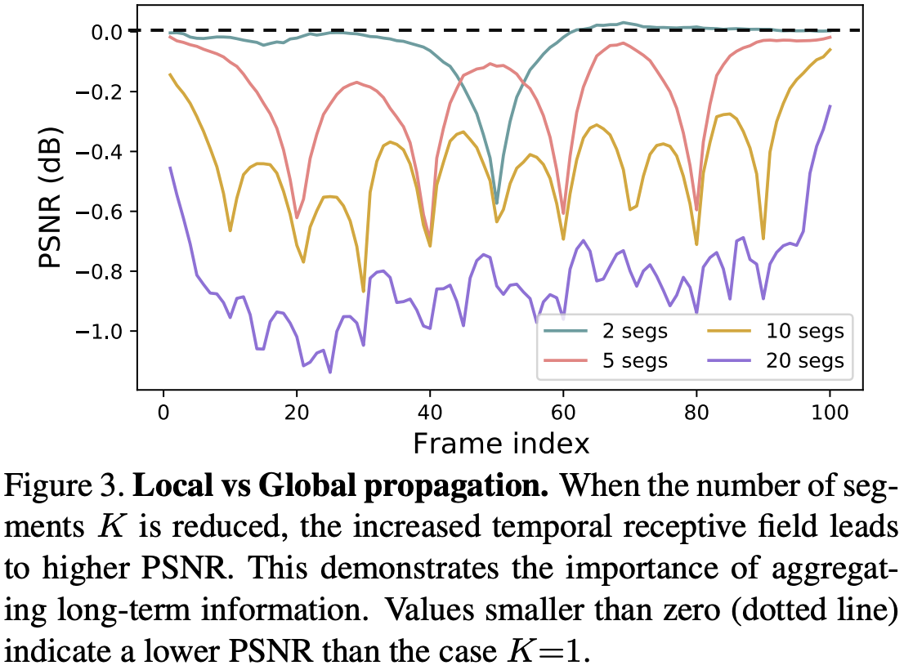

Figure: In the BasicVSR experiment, the more slices in a video, the smaller the number of frames per slice, and the worse the PSNR.

In our opinion, these duplicated frames in LQ videos are redundant to the network. If we remove duplicated frames, then the effective number of frames increases and the network performance may improve.

We first tried to remove the duplicated frames in the testing phase. We remove the duplicated frames before enhancement and restore the duplicated frames by copying after enhancement. The result slightly decreased.

We then tried to remove duplicated frames during both training and testing, and obtained a gain of around 0.05-0.1 dB.

Figure: How we deal with duplicated frames.

4/17/22: We tested our model on other data-sets, and found that the performance is unstable. For some videos, the performance can drop by 0.2 dB. So the outcome of this method is highly correlated to the data-set. Please use it carefully.

### 5.4. General Tricks

Always load pre-trained models.

Use warmup. There are two benefits:

1. In the early stage of training, the loss is very large, and a small learning rate can alleviate the excessive gradient and prevent the overflow of the large model.
2. The learning rate is set subjectively, and you don’t know how big the learning rate should be. By observing the decline of loss during the warmup stage, you can roughly choose the appropriate learning rate, which corresponds to the rapid decline of loss.

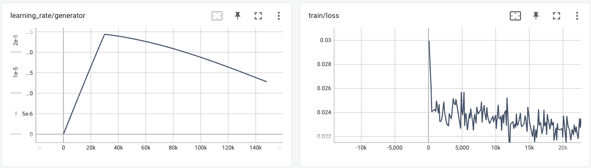

Figure: A typical curve of learning rate.

Use scheduler. Even if we use some optimizers with self-adaptation and weight decay such as Adam and AdamW, we should also use the learning rate scheduler. If the learning rate keeps high at the end of the training, it is difficult for the model to converge.

There are also other tricks we haven't tried, the principle of which is to let the model learn in an easy-to-hard manner:

- Gradual data augmentation: Do not open random flip and rotation at the beginning of training, and gradually open it as the training progresses.
- Start with small resolution: useful for classification tasks.

Note that the above tricks should be adopted separately since they have similar effects.

## 6. Optimize the Test Method

### 6.1. Remove Duplicate Frames

If the model is trained without removing duplicated frames, then removing duplicated frames at test time can result in slightly worse performance.

If the model is trained with removing duplicated frames, then removing duplicated frames at test time gives a gain of around 0.05 dB. Note that only a few videos have duplicated frames.

### 6.2. General Tricks

Model ensemble: as we mentioned earlier. The simplest and safest way is to directly average the results of the two models. Note that the performances of two models should be close.

X8tta: Flip and rotate the input image; feed the model with these augmented images separately; revert all augmentations; take the average. The model performance is directly improved by 0.1-0.2 dB.

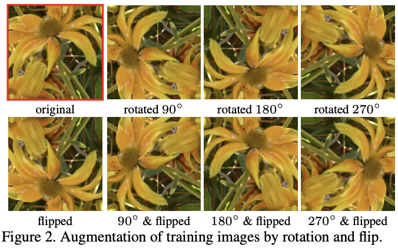

Figure: X8tta illustrated by [this article]( (https://arxiv.org/abs/1511.02228)).

## 7. Model Cascading

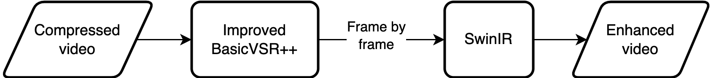

Figure: We cascade two models as our final framework.

Cascading is a must. Many articles are pointing out that instead of training one super large model, it is better to train multiple small models either for cascading or ensemble.

We tried cascading two BasicVSR++ models and found that the second model converged quickly, but behaved like an auto-encoder (AE): that is, the output is basically equal to the input. We suspect that the second model should not adopt the same network structure as that of the first model.

In the follow-up experiments, we tried [MPRNet](https://arxiv.org/abs/2102.02808) and SwinIR. The results were much better, at least they performed not like an AE anymore.

There are two reasons for us to choose MPRNet in the beginning:

1. MPRNet is the baseline model for many competition models and is widely used for low-level vision tasks such as de-blurring.
2. MPRNet has multiple inputs; we want to introduce the original input in the second stage to re-introduce the texture details lost by the first model.

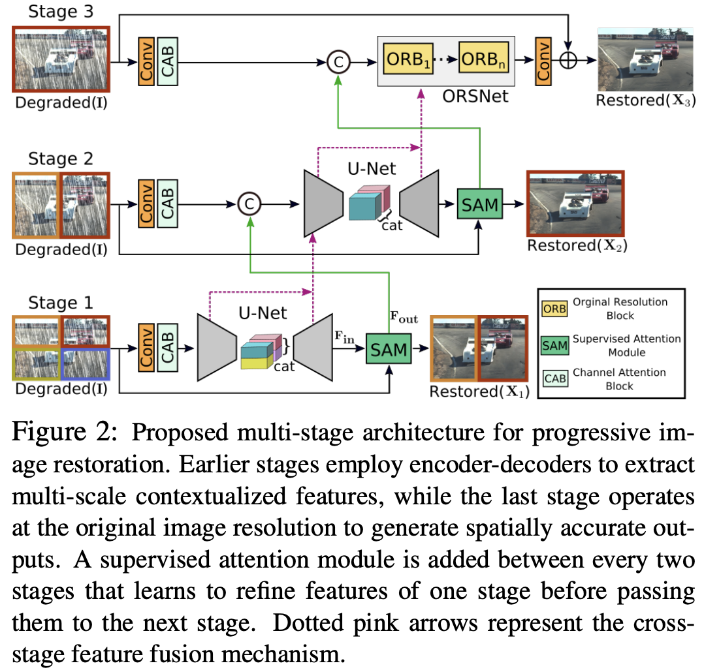

Figure: Multi-input structure of MPRNet.

We tried SwinIR later and it worked better, so we switched to SwinIR. We used SwinIR's pre-trained model for color de-noising, so we can train our model in half a day. This again demonstrates the importance of pre-training.

## 8. Postscript

In my view, our winning is mainly due to the following points:

- Planning and cooperation. Winning a competition is a big project, of which every step requires planning, division of labor, collaboration, and discussion.
- The belief to win. It's not difficult to get a good ranking; you have to be confident.
- Large numbers of experiments. We have done more than 200 sets of experiments, from which many improvements were inspired and validated. On the contrary, most of our ideas without experimental findings didn't work.
