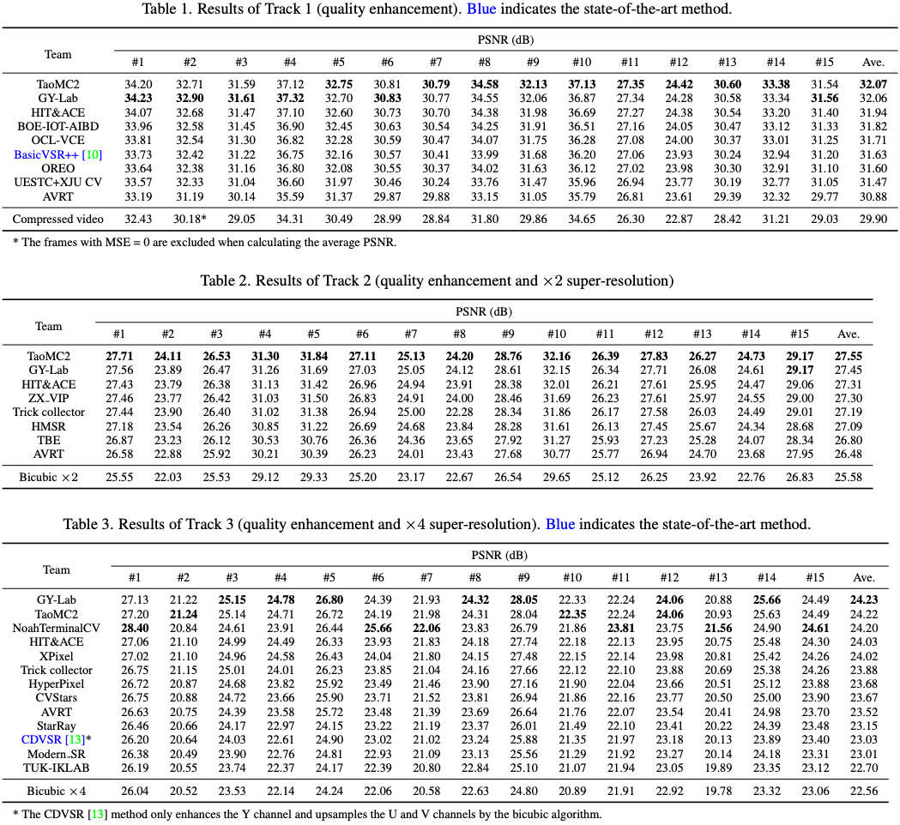
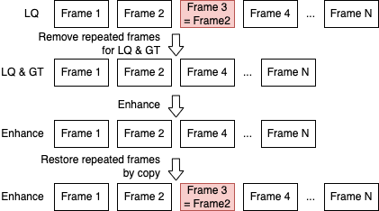

# NTIRE 2022 视频增强冠军经验分享

[[English]](https://github.com/ryanxingql/winner-ntire22-vqe/blob/main/blog_en.md) [[项目主页]](https://github.com/ryanxingql/winner-ntire22-vqe)

- [NTIRE 2022 视频增强冠军经验分享](#ntire-2022-视频增强冠军经验分享)
  - [1. 赛事背景](#1-赛事背景)
  - [2. 比赛成果](#2-比赛成果)
  - [3. 比赛方案](#3-比赛方案)
    - [3.1 PQF 传播](#31-pqf-传播)
    - [3.2 删除重复帧](#32-删除重复帧)
    - [3.3 三步收敛](#33-三步收敛)
    - [3.4 渐进收敛](#34-渐进收敛)
  - [4. 思考随笔](#4-思考随笔)
    - [4.1 为什么不使用 Video Transformer 架构](#41-为什么不使用-video-transformer-架构)
    - [4.2 深入挖掘领域内长期工作](#42-深入挖掘领域内长期工作)
    - [4.3 基础架构的复杂度要足够高](#43-基础架构的复杂度要足够高)
    - [4.4 Transformer 依赖于预训练](#44-transformer-依赖于预训练)
    - [4.5 后记](#45-后记)

## 1. 赛事背景

NTIRE 挑战赛全称 New Trends in Image Restoration and Enhancement workshop and challenges on image and video processing，是 CVPR 一系列 Workshop 中较为著名的一个（[CVPRW 2022](https://cvpr2022.thecvf.com/workshop-schedule) 一共收录了约 71 个 Workshop）。NTIRE 是 [Radu Timofte](https://scholar.google.ch/citations?user=u3MwH5kAAAAJ&hl=en) 主办的赛事，[第一次](https://data.vision.ee.ethz.ch/cvl/ntire/)在 ACCV 2016 举办，之后成为了 CVPRW 的常客。

图：CVPRW22

NTIRE 挑战赛细分了多个项目。多帧质量增强大项是 2021 年开始由[杨韧](https://scholar.google.ch/citations?user=3NgkOp0AAAAJ&hl=en)和 Radu 组织的，[最初](https://data.vision.ee.ethz.ch/cvl/ntire21/)包含「PSNR 质量优化」和「主观质量优化」两个主题。[今年](https://data.vision.ee.ethz.ch/cvl/ntire22/)主办方删除了主观质量优化赛道，只保留了 PSNR 质量优化赛道，同时引入了超分辨率、质量优化耦合赛道。

图：NTIRE21 多帧质量增强大项

图：NTIRE22 多帧质量增强大项

近年来中国互联网大厂不断涌入该赛事并宣传自己的比赛成果，赛事参与队伍越来越多，夺冠难度越来越大。21 年参赛队伍中包括北大、清华、复旦、南大、南洋理工 S-Lab、腾讯、Bilibili、字节跳动、大疆、华为诺亚、京东方等。

图：NTIRE21 参赛队伍

今年又涌入了阿里巴巴、中兴、小米等企业，还有中科院自动化所、北航、哈工大、电子科大、南京理工、SIAT 等高校和研究院，以及港中文 XPixel、腾讯 GY-Lab 等知名实验室。

[北航 MC2 Lab](http://www.buaamc2.net/) 常年关注、深耕压缩视频质量优化技术，于今年正式参与该项赛事。

## 2. 比赛成果

我们在三个赛道上分别取得了均分第一、第一和第二的好成绩。

图：比赛结果

其中，我们的算法在第二个赛道表现出全面的泛化能力，以均分高 0.1 dB 的优势取得第一。

## 3. 比赛方案

基于我们的基础架构 BasicVSR++，我们挖掘并实现了四点重要创新，从而取得了理想的赛事结果。

### 3.1 PQF 传播

PQF（关键帧）指的是视频中 PSNR 质量较高的帧，通常被赋予较高的码率或较小的量化步长。PQF 在赛事视频中呈现以下分布：头帧为 PQF，其后隔 3 帧非 PQF 出现一帧 PQF。如果用 1 表示 PQF，0 表示非 PQF，则视频帧可表示为：1000 1000 1000……

基础架构 BasicVSR++ 采用了双向传播结构，理论上每一帧增强时都能获得来自双向 PQF 的信息。但是，这种信息有时要通过多次传播才能到达。以第一个非 PQF 为例，其右侧二阶传播仍然为非 PQF。因此，我们提出用 PQF 传播替换 BasicVSR++ 中的二阶相邻帧。

图：BasicVSR++ 中的两阶传播

图：PQF 传播

实验表明，模型表现提升 0.05-0.1 dB。

### 3.2 删除重复帧

我们在制作数据集时意外发现，无论是官方数据集还是我们的额外数据集，大约有 30% 的视频存在重复帧。这些视频的 GT 中并没有重复帧，但因为相邻两帧变化较小（相邻 PSNR 在 50-70 dB），在压缩以后就变得完全相同。

图：重复帧现象

4.2 节我们会提到，时序信息在质量增强任务中发挥了至关重要的作用。BasicVSR 表明，输入帧数下降，性能也随之下降；而 VRT 之所以没有超过 BasicVSR++，一个很重要的原因正是显存有限、只能处理 16 帧视频，而 Basic 能处理 30 帧。

图：BasicVSR 实验中，一个视频中切片越多，每个片段帧数越小，PSNR 就越差

在我们看来，LQ 视频中这些重复帧对网络而言就是冗余。如果我们删除重复帧，那么有效帧数就提高了，网络性能也能随之提高？

图：处理重复帧方案

我们先只在测试阶段删除了重复帧，在增强后通过直接 copy 的方式恢复重复帧，效果几乎没变，稍微差一点点。

我们随后尝试在训练时删除重复帧，结果模型学习效果越来越出色，增益 0.05-0.1 dB 左右。

### 3.3 三步收敛

大家知道，MSE 和 PSNR 只差一个对数关系。因此，优化 MSE 本质上等价于优化 PSNR。但奇怪的是，NTIRE21 中近半队伍都使用 Charbonnier 损失函数。

我们首先做了实验，发现 Charbonnier 损失函数下模型收敛速度比 MSE 模型快很多，甚至 PSNR 也更高。大量文章佐证了这个观点，我在这里截取一篇[文章](https://www.mdpi.com/2079-9292/10/11/1234/pdf)中的图：

图：Charbonnier loss 在 SISR 任务上的 PSNR 表现比 L2 还好

我们采用了三步收敛法，获得了成功：

1. 先使用 Charbonnier loss 在自制数据集上训练。
2. 等模型收敛后，再使用 L2 loss；实验表明，模型表现进一步提升 0.02 dB。
3. 等模型收敛后，我们使用 L2 loss 在官方数据集上完成最终收敛；实验表明，模型表现进一步提升 0.02 dB。

最后一步是考虑到自制数据集可能和官方数据集的制作流程有一定偏差，且官方数据集更能反映主办方对数据的偏好。

### 3.4 渐进收敛

直接训练一个大模型是非常困难的。我们最终模型有多达 7000 万参数，规模非常庞大。且网络中每一个模块前后依赖，如果训练初期前端模块没有收敛，那么后端模块的输入就是有问题的，自然无法收敛。因此，直接端到端训练是很难得到好模型的。事实上，模型前后端依次收敛也是 Kaggle 比赛中的常用、甚至必用的方法，其目的就是让大模型的每一个模块前后依次收敛。

我们将基础架构的重建部分进一步加深。具体而言，我们每一次训练增加 10 个 residual block，从 5 加到 55（此时 32GB V100 显存打满），一共分 6 次训练和收敛。

图：在重建模块每次增加 10 个 Residual block，不固定参数；每次都要加载上一次训练好的参数

这样一套下来，训练成本非常高，但增益也很明显。实验表明，和直接端到端训练大模型相比，提升约 0.1 dB。

## 4. 思考随笔

### 4.1 为什么不使用 Video Transformer 架构

在选择基础模型时，我们遇到了一个问题：要不要随大流，选择一个基于 Video Transformer 的网络结构。我们比较担心今年的对手会采取类似的策略，在算法学习能力上和我们拉开差距。

经过大量调研，我们分析了 Transformer 的可行性和可靠性：

- 显存不足：Video transformer 中的代表 VRT 使用了 8 卡 80 GB A100。而我们的计算资源为 1 台 8 卡 32GB V100 服务器和若干台 4 卡 32GB V100 服务器。
- 耗时太长：VRT 一个模型要训练 5-7 天左右；而 A100 的速度是 V100 的 3 倍，因此我们训练一个相同的模型需要至少半个月。
- 资源有限下性能堪忧：根据 VRT 的报告，在 7 帧短视频（如 Vimeo 数据集）上，VRT 性能超过 BasicVSR++；但对于长视频（如 REDS 每个视频 100 帧），由于显存受限，VRT 无法一次性输入超过 16 帧的视频，性能上无法超过 BasicVSR++（能一次性输入 30 帧以上）。

图：VRT 实验报告

基于上述原因，特别是性能考量，我们放弃将 Video transformer 作为基础架构。

### 4.2 深入挖掘领域内长期工作

为了更好地改进基础模型，我们对领域内的长期工作者进行了研究。其中一定会有心得体会和关键成果。

以 BasicVSR 提出者 Kelvin 的工作为例。

Kelvin 在 2021 年 AAAI 一篇[文章](https://arxiv.org/abs/2009.07265)中研究了 EDVR 的性能瓶颈。在这篇文章中，Kelvin 告诉大家，虽然在特征域上进行时序对齐的 DCN 要比传统的、在像素域上进行对齐的光流方法更强大，但他们的学习目标和效果几乎是一样的。那么，既然端到端学习时 DCN offset 如此不稳定、难学，我们就单独给 DCN offset 加一个损失函数，要求它和光流输出保持一致。通过额外的监督，就稳定了 DCN offset 的学习。

图：EDVR 中 DCN 溢出通常发生在 300K iterations，此时模型 loss 也不降反升

图：Flow 和 DCN offset 的形态几乎一模一样，这为后面 DCN offset 的稳定性改进埋下了伏笔

Kelvin 在 BasicVSR++ 中进一步改善了这个策略，即将光流输出作为 Base，额外学习一个 Residual，然后把 Base 和 Residual 加起来作为 DCN 的 offset。

图：BasicVSR++ 中的 flow-based DCN offset

从以上研究历程中我们得到两点关键：

- 对齐在视频增强任务中起到了非常重要的作用。这是 EDVR 的瓶颈。
- 我们不能再沿用 EDVR 或 STDF 的 DCN 方法，而是使用更为先进的、基于 flow 的 DCN 方法。

再以我们实验室工作为例。

在 19 年 ICME 一篇[文章](https://arxiv.org/abs/1903.04596)中，杨韧研究了 LSTM 中不同帧的参与度，结果 PQF 确实起到了非常重要的作用。

图：PQF 在 LSTM 质量增强任务上起到了非常重要的作用

在本人 19 年 [MFQEv2](https://arxiv.org/abs/1902.09707) 溶解试验中，我尝试过将相邻帧输入滑窗网络，结果增强性能剧烈下降，远不如输入 PQF 的网络。

图：PQF 在滑窗网络质量增强任务上同样非常重要

因此，PQF 在压缩视频质量增强任务中起到关键作用，必须用。

### 4.3 基础架构的复杂度要足够高

我们尝试过大量的网络结构优化，大多都没有取得理想的效果。例如，我们仿照 [IconVSR](https://arxiv.org/abs/2012.02181)，在 PQF 上额外建立了 refill 支路；此外，我们仿照 [RealBasicVSR](https://arxiv.org/abs/2111.12704)，对输入图像进行 pre-cleaning；我们把这些设计应用到了 BasicVSR++ 这种大模型上，没有产生任何效果。

图：对关键帧的特征加强提取（refill）

图：对输入图像预去噪再提取特征

我个人认为，有很多论文中有效的方法，很有可能只是因为计算量上去了。当我们在复杂度足够大的网络上实践时，往往就丢掉了魔力。这也是为什么我们要选择复杂度足够高且证明有效的网络结构作为基础模型。

### 4.4 Transformer 依赖于预训练

我们尝试将基础 Residual block 替换为 Swin block。但效果不佳。具体而言，我们尝试过将前端 Residual block 替换为 Swin block，也尝试过替换后端 Residual block。

尽管效果都没有超过基于 Residual block 的网络，但其中替换后端 Residual block 的效果最好。我们怀疑，替换前端 Residual block，会导致后端模块要基于随机初始化的前端 Swin block 重新训练，因而效果不佳，在训练初期有非常大的误差传播。

我们猜测，Transformer 要用得好，必须得在大规模数据库上预训练过（根据其他论文）。直接 Copy 一个 Swin block 过来从头训练，很难达到或超越 CNN 的效果。

### 4.5 后记

我们做到了以下很重要的几点：

- 规划和合作。打比赛是一个系统工程，每一步都需要计划、分工、协作、探讨。越到后期越觉得，我们团队少一个人都不行，每个人的付出都特别关键。
- 取胜的信念。拿一个好的名次并不难，要有信心，特别是在比赛末期大伙刷榜的时候。
- 充分的实验。全组在探索阶段做了几百组实验，有很多改进点是从实验中摸索出来的。拍脑门想出来的方案大多不 Work。
